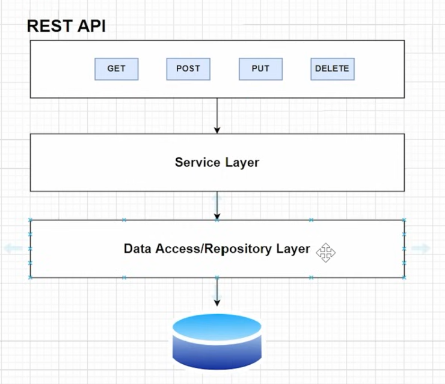
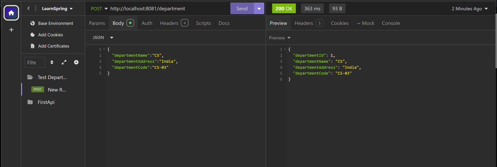

# Learn Spring Boot

## Controller
- Here we Create the endpoint that we hit using any browser or API tool 
- it is the entry point of the system 
```java
package com.LearnSpring.OneShot.controller;

import org.springframework.web.bind.annotation.GetMapping;
import org.springframework.web.bind.annotation.RestController;

// The @RestController annotation indicates that this class will handle web requests.
// It's a specialized version of @Controller that combines @Controller and @ResponseBody, 
// allowing the methods to return data directly as HTTP responses (often in JSON format).

@RestController
public class HelloController {

    // The @GetMapping("/") annotation maps HTTP GET requests to the "/" URL path 
    // (i.e., the root path of the application) to this method.
    // When a GET request is made to this URL, the HelloWorld method is called.

    @GetMapping("/")
    public String HelloWorld() {
        // This method returns a simple string response: "First API".
        // The returned string will be sent as the response body of the GET request.
        return "First API";
    }
}

```
- this is the basics of what we are gonna learn 

## What are we gonna build ? 


### Three Layer Architecture
    - Three layer Architecture includes
        - Controller layer
        - Service layer
        - Repoistory layer

## What is Controller layer ?  
The **Controller layer** in software architecture is responsible for handling incoming HTTP requests from the client, processing those requests, and sending responses back. In a typical **Model-View-Controller (MVC)** architecture, the controller acts as an intermediary between the **Model** (which contains the business logic and data) and the **View** (which is responsible for the presentation of data).

In the context of **Spring Boot**, the Controller layer:

1. **Handles Requests**: The controller listens for requests sent by the client (e.g., browser, mobile app) and maps them to specific methods. It typically uses annotations like `@GetMapping`, `@PostMapping`, `@PutMapping`, etc., to specify which URL patterns and HTTP methods it handles.

2. **Processes Requests**: The controller interacts with the **Service layer** (if present) or directly with the **Model** to process the request, fetch data, or execute business logic.

3. **Returns Responses**: After processing, the controller prepares a response (which could be JSON, XML, HTML, etc.) and sends it back to the client. In REST APIs, the response is often in JSON or XML format.

### Key Concepts:
- **@RestController**: Used in Spring Boot to indicate that the class is a REST controller, which means it will return data directly (like JSON or XML) instead of rendering a view (HTML).
- **Request Mapping**: Annotations like `@GetMapping`, `@PostMapping`, `@PutMapping` are used to define which URL paths and HTTP methods the controller will handle.

### Example Workflow:
1. **Client sends a request**: `GET /api/users/123`.
2. **Controller receives the request**: The controller method corresponding to the `/api/users/{id}` endpoint is invoked.
3. **Controller interacts with the service/model**: It calls the service to retrieve user data based on the user ID.
4. **Controller sends the response**: The retrieved user data is converted to a JSON response and sent back to the client.

The Controller layer's primary responsibility is managing the flow of data and requests, allowing for a clean separation between user interaction and business logic.

## What is Service layer ?
The **Service layer** in software architecture is responsible for implementing the business logic and handling operations that involve the core functionality of the application. It acts as an intermediary between the **Controller layer** (which handles incoming requests) and the **Data Access layer** (which interacts with the database or external data sources).

### Responsibilities of the Service Layer:
1. **Business Logic**: This layer contains the business rules and logic that govern how data should be processed. It ensures that the application behaves according to the business requirements.

2. **Data Transformation**: The service layer often transforms or processes data retrieved from the database or other external sources before passing it to the controller.

3. **Transaction Management**: In many applications, the service layer is responsible for handling transactions (like saving or updating data in the database). It ensures that multiple operations either complete successfully together or are rolled back in case of errors.

4. **Decoupling Business Logic from Presentation**: The service layer decouples the business logic from the web layer (controller) and data access layer, promoting cleaner code and easier maintenance.

5. **Communication with Other Services**: In more complex systems, the service layer might communicate with other services, microservices, or external APIs to perform specific tasks.

### Key Benefits:
- **Separation of Concerns**: The controller focuses on handling HTTP requests and responses, while the service layer handles business rules, leading to a clear separation of concerns.
- **Reusability**: Business logic is centralized in the service layer, making it reusable across different parts of the application.
- **Testability**: The service layer can be easily tested in isolation from the rest of the system, allowing for better unit testing.

### Example:
Consider a banking application where you want to transfer money between accounts. The controller handles the HTTP request, but the service layer is where the core logic (like checking account balances, debiting one account, crediting another) is performed.

```java
@Service
public class AccountService {

    // Injecting a repository that interacts with the database
    @Autowired
    private AccountRepository accountRepository;

    // Business logic for transferring money between accounts
    public void transferMoney(long fromAccountId, long toAccountId, double amount) {
        // Fetch account details
        Account fromAccount = accountRepository.findById(fromAccountId);
        Account toAccount = accountRepository.findById(toAccountId);

        // Perform business logic: check if there is enough balance
        if (fromAccount.getBalance() < amount) {
            throw new InsufficientFundsException("Not enough balance");
        }

        // Debit from one account and credit the other
        fromAccount.debit(amount);
        toAccount.credit(amount);

        // Save the updated account data
        accountRepository.save(fromAccount);
        accountRepository.save(toAccount);
    }
}
```

### Key Annotations in Spring Boot:
- **@Service**: Marks a class as a service, indicating that it contains business logic.
- **@Transactional**: Used to ensure that a group of operations within the service layer are treated as a single transaction (if one fails, all are rolled back).

In summary, the **Service layer** is crucial for maintaining the core business logic and ensuring a clean, maintainable, and testable code structure.

## What is Repository layer ?
The **Repository layer** (also known as the **Data Access Layer**) in software architecture is responsible for interacting with the database or any other data storage mechanism. It provides an abstraction over the data access logic, allowing the service layer to access data without directly dealing with database queries. In **Spring Data JPA**, the repository layer is commonly used to perform CRUD operations (Create, Read, Update, Delete) without writing any SQL queries.

### Responsibilities of the Repository Layer:
1. **Data Access Abstraction**: It provides a clean separation between business logic (service layer) and data access logic. The repository hides the underlying database interaction.

2. **CRUD Operations**: The repository layer typically provides methods to create, read, update, and delete data in the database.

3. **Query Customization**: You can define custom queries using JPQL (Java Persistence Query Language) or native SQL queries.

4. **Pagination and Sorting**: The repository can handle pagination and sorting of data directly.

### Example in Spring Boot:
In Spring, a repository interface extends `JpaRepository` (or other repository interfaces) to automatically provide data access methods without implementing them manually.

```java
import org.springframework.data.jpa.repository.JpaRepository;

public interface UserRepository extends JpaRepository<User, Long> {
    // Additional custom query methods can be defined here
    User findByUsername(String username); // Query method to find a user by username
}
```

- **`JpaRepository<T, ID>`** is a JPA-specific extension of the `Repository` interface in Spring Data. It includes methods like `findAll()`, `save()`, `deleteById()`, etc.

---

### **H2 Database**
**H2** is an open-source, lightweight, and fast in-memory database often used for development, testing, or small-scale applications. It can be embedded in Java applications, making it convenient for development environments where you need a quick database setup without configuring a full-fledged database like MySQL, PostgreSQL, etc.

#### Key Features of H2:
1. **In-memory Database**: Data is stored in memory, so it is lost when the application shuts down (unless you configure persistent storage).
2. **Easy Integration with Spring Boot**: H2 can be integrated with Spring Boot easily for prototyping and testing.
3. **Web Console**: H2 provides a web-based console where you can run SQL queries and inspect the database schema and data.

#### How to Use H2 in Spring Boot:
- Add H2 dependency in `pom.xml`:
```xml
<dependency>
    <groupId>com.h2database</groupId>
    <artifactId>h2</artifactId>
    <scope>runtime</scope>
</dependency>
```

- Configure H2 in `application.properties`:
```properties
spring.datasource.url=jdbc:h2:mem:testdb
spring.datasource.driverClassName=org.h2.Driver
spring.datasource.username=sa
spring.datasource.password=password
spring.h2.console.enabled=true
spring.jpa.hibernate.ddl-auto=update
```

- Access H2 Console:
    - Go to `http://localhost:8080/h2-console` to access the H2 database's web console.

---

### **Java Persistence API (JPA)**
**Java Persistence API (JPA)** is a specification in Java that provides a way to manage relational data using object-relational mapping (ORM). It allows developers to map Java objects to database tables and work with relational data using Java objects instead of writing SQL directly.

#### Key Concepts of JPA:
1. **Entity**: A Java class mapped to a database table. Each instance of the entity corresponds to a row in the table.
2. **EntityManager**: Used for managing database operations such as persisting (saving), removing (deleting), and querying entities.
3. **ORM (Object-Relational Mapping)**: It automatically handles the mapping between Java objects and database tables using annotations or XML.

#### Example of JPA Entity:
```java
import javax.persistence.Entity;
import javax.persistence.Id;

@Entity
public class User {

    @Id
    private Long id;
    private String username;
    private String email;

    // Getters and setters
}
```

#### Annotations in JPA:
- **@Entity**: Marks the class as a JPA entity, meaning it will be mapped to a database table.
- **@Id**: Specifies the primary key of the entity.
- **@Table**: Specifies the table name if different from the class name.
- **@Column**: Specifies details for columns (optional).

---

### **Relationship Between Repository, H2, and JPA**
1. **JPA**: Defines the standard for working with relational data in Java, including how Java objects (entities) are mapped to database tables.

2. **H2**: Can be used as the underlying database for storing entities when working with JPA, especially in a development environment.

3. **Repository Layer**: Works with JPA to abstract the interaction with the database (H2, MySQL, etc.). The `JpaRepository` interface is often used in Spring applications to perform data access tasks without writing boilerplate code.

In a Spring Boot project, JPA handles the interaction between your entities and the database (like H2), while the repository layer provides methods to query and manipulate that data.

# Now we can Start with our code
## Step 1: 
  - Add Configurarions for **H2** and **JPA**
  - as mentioned in [How to Use H2 in Spring Boot](#how-to-use-h2-in-spring-boot)
```properties
    spring.h2.console.enabled=true
    spring.datasource.url=jdbc:h2:mem:dcbapp
    spring.datasource.driverClassName=org.h2.Driver
    spring.datasource.username=sa
    spring.datasource.password=password
    spring.jpa.database-platform=org.hibernate.dialect.H2Dialect
    spring.jpa.hibernate.ddl-auto=update
```
## Step 2:
  - Create entity, service, repository, config and controller Packages
  - Add lombok dependency 
```xml
    <dependency>
      <groupId>org.projectlombok</groupId>
      <artifactId>lombok</artifactId>
      <optional>true</optional>
    </dependency>
```
## Lombok
Lombok is a Java library that simplifies the development process by reducing boilerplate code. It provides a set of annotations that automatically generate common methods, such as getters, setters, constructors, and more, at compile time. This can significantly reduce the amount of code you have to write and maintain.

### Key Features and Annotations of Lombok

1. **`@Getter` and `@Setter`**:
    - **Purpose**: Automatically generates getter and setter methods for all fields in a class.
    - **Usage**:
      ```java
      @Getter @Setter
      public class Person {
          private String name;
          private int age;
      }
      ```

2. **`@ToString`**:
    - **Purpose**: Automatically generates the `toString` method for the class, including specified fields.
    - **Usage**:
      ```java
      @ToString
      public class Person {
          private String name;
          private int age;
      }
      ```

    - **Customizing**:
      ```java
      @ToString(onlyExplicitlyIncluded = true)
      public class Person {
          @ToString.Include
          private String name;
          private int age;
      }
      ```

3. **`@EqualsAndHashCode`**:
    - **Purpose**: Automatically generates `equals` and `hashCode` methods based on the fields of the class.
    - **Usage**:
      ```java
      @EqualsAndHashCode
      public class Person {
          private String name;
          private int age;
      }
      ```

    - **Customizing**:
      ```java
      @EqualsAndHashCode(of = "name")
      public class Person {
          private String name;
          private int age;
      }
      ```

4. **`@NoArgsConstructor`, `@AllArgsConstructor`, and `@RequiredArgsConstructor`**:
    - **Purpose**: Automatically generates constructors.
        - `@NoArgsConstructor`: Creates a no-argument constructor.
        - `@AllArgsConstructor`: Creates a constructor with all arguments.
        - `@RequiredArgsConstructor`: Creates a constructor with required arguments (final fields and fields marked with `@NonNull`).
    - **Usage**:
      ```java
      @NoArgsConstructor
      @AllArgsConstructor
      public class Person {
          private String name;
          private int age;
      }
      ```

5. **`@Data`**:
    - **Purpose**: Combines `@Getter`, `@Setter`, `@ToString`, `@EqualsAndHashCode`, and `@RequiredArgsConstructor` in a single annotation.
    - **Usage**:
      ```java
      @Data
      public class Person {
          private String name;
          private int age;
      }
      ```

6. **`@Builder`**:
    - **Purpose**: Provides a builder pattern for constructing objects.
    - **Usage**:
      ```java
      @Builder
      public class Person {
          private String name;
          private int age;
      }
      ```

    - **Example**:
      ```java
      Person person = Person.builder()
                            .name("John")
                            .age(30)
                            .build();
      ```

7. **`@Slf4j`, `@Log4j2`, etc.**:
    - **Purpose**: Provides logging capabilities by creating a logger instance.
    - **Usage**:
      ```java
      @Slf4j
      public class MyService {
          public void performAction() {
              log.info("Action performed");
          }
      }
      ```

    - **Other Loggers**:
        - `@Log` for `java.util.logging`
        - `@Log4j` for Apache Log4j 1.x
        - `@Log4j2` for Apache Log4j 2.x
        - `@CommonsLog` for Apache Commons Logging

8. **`@Value`**:
    - **Purpose**: Creates an immutable class with final fields, and provides `@Getter`, `@RequiredArgsConstructor`, `@ToString`, and `@EqualsAndHashCode`.
    - **Usage**:
      ```java
      @Value
      public class Person {
          private String name;
          private int age;
      }
      ```

9. **`@NonNull`**:
    - **Purpose**: Ensures that a field is not null and throws a `NullPointerException` if it is.
    - **Usage**:
      ```java
      public class Person {
          @NonNull
          private String name;
      }
      ```

### Benefits of Using Lombok

1. **Reduces Boilerplate Code**: Lombok helps in writing less code by generating common methods and boilerplate code.
2. **Improves Readability**: The code becomes cleaner and more readable as it focuses on business logic rather than repetitive code.
3. **Enhances Maintainability**: Less code means fewer places to update if the data structure changes.
4. **Standardization**: By using annotations, you maintain consistency across the codebase.

### How to Add Lombok to a Spring Boot Project

1. **Add Lombok Dependency**:

   **For Maven:**
   ```xml
   <dependency>
       <groupId>org.projectlombok</groupId>
       <artifactId>lombok</artifactId>
       <version>1.18.24</version>
       <scope>provided</scope>
   </dependency>
   ```

   **For Gradle:**
   ```groovy
   implementation 'org.projectlombok:lombok:1.18.24'
   ```

2. **Enable Annotation Processing**:
    - In **IDEA IntelliJ**, enable annotation processing: `File` -> `Settings` -> `Build, Execution, Deployment` -> `Compiler` -> `Annotation Processors` -> `Enable annotation processing`.
    - In **Eclipse**, ensure annotation processing is enabled: `Project` -> `Properties` -> `Java Compiler` -> `Annotation Processing` -> `Enable annotation processing`.

Lombok is a powerful tool for reducing boilerplate code and enhancing the clarity and maintainability of Java applications. However, it's essential to use it judiciously and understand the code it generates to avoid potential issues during development and debugging.
  - Create a department entity in entity package
```java
package com.LearnSpring.OneShot.entity;

import jakarta.persistence.Entity;
import jakarta.persistence.GeneratedValue;
import jakarta.persistence.GenerationType;
import jakarta.persistence.Id;
import lombok.AllArgsConstructor;
import lombok.Builder;
import lombok.Data;
import lombok.NoArgsConstructor;

@Data
@AllArgsConstructor
@NoArgsConstructor
@Builder
@Entity
public class Department {
    @Id
    @GeneratedValue(strategy = GenerationType.AUTO)
    private Long departmentId;
    private String departmentName;
    private String departmentAddress;
    private String departmentCode;
}

```
- Create a Deprtment Controller controller in controller package
### Important Interface + Class
Creating an **interface** for a **service** and **repository** in software development, especially in frameworks like Spring Boot, follows a **standard design approach** that promotes clean architecture, flexibility, and maintainability. This approach adheres to well-known principles of software design like **SOLID** principles and **Separation of Concerns**.

### **Key Reasons for Creating Interfaces Before Implementation:**

1. **Decoupling and Flexibility:**
  - By defining an interface, the service or repository logic is decoupled from its implementation. This means the client (which could be another class or layer) only depends on the **interface** and not the **implementation**, promoting **loose coupling**.
  - It allows you to switch the implementation easily. For example, if you need to replace your repository’s database implementation (e.g., from H2 to MySQL), you can just create a new implementation of the interface without modifying the code that uses the repository.

2. **Abstraction**:
  - The interface provides an **abstract contract** that defines what a service or repository is supposed to do without exposing the internal details of how it does it. This simplifies interactions between layers (e.g., service and controller layers) by hiding unnecessary details.

3. **Testability**:
  - Interfaces make **unit testing** and **mocking** much easier. For instance, if you're testing the service layer, you can mock the repository interface without worrying about the actual repository implementation.
  - Tools like **Mockito** allow you to create mocks of interfaces so that tests focus only on the logic of the method under test, not on external dependencies like databases.

4. **Interchangeable Implementations**:
  - You can have multiple implementations of the same interface. For example:
    - A `UserRepository` interface can have different implementations for **SQL** databases, **NoSQL** databases, or even **in-memory** databases.
    - A `NotificationService` interface could have multiple implementations like **EmailNotificationService**, **SMSNotificationService**, or **PushNotificationService**.
  - This is especially useful in projects where different environments or features require different implementations.

5. **Follows SOLID Principles**:
  - **Interface Segregation Principle (ISP)**: This principle suggests that clients should not be forced to depend on interfaces they do not use. By creating smaller, specialized interfaces for each service or repository, you ensure that classes only depend on what they need.
  - **Dependency Inversion Principle (DIP)**: High-level modules (like controllers) should depend on abstractions (interfaces), not on low-level modules (implementations). This makes it easier to maintain and extend the application as the high-level modules don’t need to be aware of the implementation details.

6. **Separation of Concerns (SoC)**:
  - Defining an interface and then creating an implementation separates the contract (what the service/repository should do) from the logic (how it is done). This division helps in keeping the code clean and modular.

### Example Approach: Service and Repository Interface in Spring Boot

#### 1. **Repository Interface:**
```java
// Define the contract for repository
public interface UserRepository {
    User findUserById(Long id);
    void saveUser(User user);
}
```

#### 2. **Repository Implementation:**
```java
// Implementation of repository, could interact with a database
@Repository
public class UserRepositoryImpl implements UserRepository {

    @Autowired
    private EntityManager entityManager;

    @Override
    public User findUserById(Long id) {
        return entityManager.find(User.class, id);
    }

    @Override
    public void saveUser(User user) {
        entityManager.persist(user);
    }
}
```

#### 3. **Service Interface:**
```java
// Define the service interface
public interface UserService {
    User getUserById(Long id);
    void createUser(User user);
}
```

#### 4. **Service Implementation:**
```java
// Implementation of service that interacts with the repository
@Service
public class UserServiceImpl implements UserService {

    @Autowired
    private UserRepository userRepository;

    @Override
    public User getUserById(Long id) {
        return userRepository.findUserById(id);
    }

    @Override
    public void createUser(User user) {
        userRepository.saveUser(user);
    }
}
```

### **Advantages of This Approach:**
- **Modularity**: Each part of the codebase (controller, service, repository) only needs to know about the interfaces, not the concrete implementations.
- **Easier Refactoring**: Since the code depends on interfaces, you can change the implementation details (e.g., changing the database technology) without affecting other parts of the application.
- **Maintainability**: It’s easier to maintain and extend as business logic changes over time. Implementations can evolve independently as long as they adhere to the interface contract.
- **Scalability**: As applications grow in complexity, adding new implementations or altering existing behavior becomes simpler.

### Conclusion:
Creating an interface for a service or repository before implementing them is a **best practice** in object-oriented design that enhances the flexibility, testability, and maintainability of the codebase. By adhering to these principles, you create systems that are more adaptable to change, easier to test, and scalable for future growth.

## Step 3:
    - Create in service package
        - Interface -> IDepartmentService
        - Class for Implentation -> DepartmentServiceImpl
    - Create in repository package
        - Interface -> IDepartmentRepository
- We don't create a solid class for repo as the functions are directly given by JPA

# Save Department API
- **Note :** Find the explaination in the code itself (Comments) 
- first we create a DepartmentControllr controller to give an endpoint 
```java
package com.LearnSpring.OneShot.controller;

import com.LearnSpring.OneShot.entity.Department; // Importing the Department entity
import com.LearnSpring.OneShot.service.IDepartmentService; // Importing the Department service interface
import org.springframework.beans.factory.annotation.Autowired; // For dependency injection
import org.springframework.web.bind.annotation.PostMapping; // Mapping HTTP POST requests
import org.springframework.web.bind.annotation.RequestBody; // For handling request body
import org.springframework.web.bind.annotation.RestController; // Marks this class as a REST controller

/**
 * This is the controller class for managing department-related operations.
 * It handles incoming HTTP requests and forwards them to the service layer.
 */
@RestController
public class DepartmentController {

    // Service layer dependency to handle business logic for departments
    private IDepartmentService departmentService;

    /**
     * Constructor-based dependency injection of the department service.
     * This ensures that the controller has access to the service layer.
     *
     * @param departmentService The service interface for department-related operations.
     */
    @Autowired
    public DepartmentController(IDepartmentService departmentService) {
        this.departmentService = departmentService;
    }

    /**
     * HTTP POST endpoint to save a department.
     * This method accepts a department object from the request body and sends it to the service layer to be saved.
     *
     * @param department The department object received in the request body.
     * @return The saved department object.
     */
    @PostMapping("/department")
    public Department saveDepartment(@RequestBody Department department) {
        // Calling the service layer to save the department and returning the saved department
        return departmentService.saveDepartment(department);
    }
}

```
- From controller, we call in DepartmentService here we use the interface and solid class design [Important](#important-interface--class) 
- Now modify the following service package classes as the following code
  - IDepartmentService and DepartmentServiceImpl
  
```java
    package com.LearnSpring.OneShot.service;

    import com.LearnSpring.OneShot.entity.Department; // Importing the Department entity
    
    /**
     * Interface for Department service operations.
     * Defines the contract for department-related business logic.
     */
    public interface IDepartmentService {

    /**
     * Method to save a department.
     * This method is implemented by the service class to handle department saving logic.
     *
     * @param department The department object to be saved.
     * @return The saved department object.
     */
    public Department saveDepartment(Department department);
}

```
```java
package com.LearnSpring.OneShot.service;

import com.LearnSpring.OneShot.entity.Department; // Importing the Department entity
import com.LearnSpring.OneShot.repository.IDepartmentRepository; // Importing the Department repository interface
import org.springframework.beans.factory.annotation.Autowired; // For dependency injection
import org.springframework.stereotype.Service; // Marks this class as a service

/**
 * Implementation of the IDepartmentService interface.
 * Provides the business logic for department-related operations.
 */
@Service
public class DepartmentServiceImpl implements IDepartmentService {

    // Repository dependency for interacting with the database
    private IDepartmentRepository departmentRepository;

    /**
     * Constructor-based dependency injection of the department repository.
     * This ensures that the service has access to the repository for data access.
     *
     * @param departmentRepository The repository interface for department-related data operations.
     */
    @Autowired
    public DepartmentServiceImpl(IDepartmentRepository departmentRepository) {
        this.departmentRepository = departmentRepository;
    }

    /**
     * Implements the saveDepartment method from IDepartmentService.
     * Uses the repository to save the department and return the saved entity.
     *
     * @param department The department object to be saved.
     * @return The saved department object.
     */
    @Override
    public Department saveDepartment(Department department) {
        // Delegates the saving operation to the repository
        return departmentRepository.save(department); // Uses JPA repository to persist the department
    }
}

```
- In the repository package modify the already created IDepartmentRepository as follows 
```java
package com.LearnSpring.OneShot.repository;

import com.LearnSpring.OneShot.entity.Department; // Importing the Department entity
import org.springframework.data.jpa.repository.JpaRepository; // Importing the JpaRepository interface from Spring Data JPA
import org.springframework.stereotype.Repository; // Importing the Repository annotation

/**
 * Repository interface for Department entity.
 * Extends JpaRepository to provide CRUD operations for the Department entity.
 */
@Repository
public interface IDepartmentRepository extends JpaRepository<Department, Long> {
    // No additional methods are defined here. JpaRepository provides basic CRUD operations out-of-the-box.
}

```

- Now Run the project and test the api from any of API Clients 
- This is the sample output from insomnia



## This way we will create all other APIs  

### APIs Implemented :
 **Note : for the following APIs kindly view the source code and follow the paths provided in this doc to know the flow** 

#### Basic Crud
- List All Departments 
- Get Department By Id
- Delete Department By Id
- Update Department By Id

#### Extra Endpoints
**Note : For creating your own query methods in JPA Refer**
[here](https://docs.spring.io/spring-data/jpa/reference/jpa/query-methods.html)

- Find By Department Name
### Find the final version of the Department related classes and learn through comments

# Hibernate Validations
Hibernate Validator is the reference implementation of the Bean Validation specification (JSR 380). In Spring Boot, Hibernate Validator is integrated to help validate JavaBeans (objects) based on constraints defined in the Java code. This ensures that data meets specific criteria before it is processed or persisted.

### Key Concepts

1. **Bean Validation Specification (JSR 380)**:
    - **Purpose**: Defines a standard way to validate JavaBeans using annotations.
    - **Annotations**: Provides built-in annotations like `@NotNull`, `@Size`, `@Min`, `@Max`, etc., for defining constraints on bean properties.

2. **Hibernate Validator**:
    - **Implementation**: Hibernate Validator is the default implementation of JSR 380. It provides additional constraints and features on top of the standard ones.
    - **Integration**: Spring Boot includes Hibernate Validator by default, so you don’t need to add it manually.

### Setting Up Hibernate Validator in Spring Boot

1. **Add Dependencies**:
    - Spring Boot automatically includes Hibernate Validator. If you are using Spring Boot Starter, it should already be included. If not, ensure you have the following dependency in your `pom.xml` (for Maven):

      ```xml
      <dependency>
          <groupId>org.springframework.boot</groupId>
          <artifactId>spring-boot-starter-validation</artifactId>
      </dependency>
      ```

    - For Gradle, include:

      ```groovy
      implementation 'org.springframework.boot:spring-boot-starter-validation'
      ```

2. **Define Constraints**:
    - Use Bean Validation annotations on your model class to define constraints. For example:

      ```java
      import javax.validation.constraints.NotNull;
      import javax.validation.constraints.Size;
      import javax.validation.constraints.Min;
      import javax.validation.constraints.Max;
 
      public class Department {
          
          @NotNull
          private Long id;
 
          @Size(min = 2, max = 30)
          private String departmentName;
 
          @Min(1)
          @Max(100)
          private Integer departmentCode;
 
          // Getters and setters
      }
      ```

3. **Validation in Controllers**:
    - To enforce validation in a Spring Boot controller, use the `@Valid` annotation with a `@RequestBody` or `@ModelAttribute`. For example:

      ```java
      import org.springframework.web.bind.annotation.PostMapping;
      import org.springframework.web.bind.annotation.RequestBody;
      import org.springframework.web.bind.annotation.RestController;
      import javax.validation.Valid;
 
      @RestController
      public class DepartmentController {
          
          @PostMapping("/departments")
          public Department saveDepartment(@Valid @RequestBody Department department) {
              // Save the department
              return department;
          }
      }
      ```

    - If the data does not meet the constraints, a `MethodArgumentNotValidException` will be thrown, and Spring Boot will handle it by returning a suitable response.

4. **Custom Constraints**:
    - You can also define custom validation constraints by creating your own annotations and validators.

      ```java
      import javax.validation.Constraint;
      import javax.validation.Payload;
      import java.lang.annotation.ElementType;
      import java.lang.annotation.Retention;
      import java.lang.annotation.RetentionPolicy;
      import java.lang.annotation.Target;
 
      @Target({ElementType.FIELD})
      @Retention(RetentionPolicy.RUNTIME)
      @Constraint(validatedBy = CustomValidator.class)
      public @interface ValidCustom {
          String message() default "Invalid value";
          Class<?>[] groups() default {};
          Class<? extends Payload>[] payload() default {};
      }
      ```

      And the corresponding validator:

      ```java
      import javax.validation.ConstraintValidator;
      import javax.validation.ConstraintValidatorContext;
 
      public class CustomValidator implements ConstraintValidator<ValidCustom, String> {
          @Override
          public void initialize(ValidCustom constraintAnnotation) {}
 
          @Override
          public boolean isValid(String value, ConstraintValidatorContext context) {
              // Custom validation logic
              return value != null && value.matches("^[A-Za-z]*$");
          }
      }
      ```

### Benefits

- **Consistency**: Provides a standardized way to validate objects.
- **Automatic Validation**: Automatically validates input data before it reaches the business logic layer.
- **Customizable**: Allows you to create custom validation logic to meet specific needs.
- **Integration**: Seamlessly integrates with Spring Boot and Spring MVC.

Hibernate Validator in Spring Boot simplifies the process of validating objects and ensures that only valid data is processed, helping to maintain the integrity and quality of data in your application.

## We have added the validation in Department entity 
# Adding Loggers
Adding logging to a Spring Boot application is straightforward thanks to its built-in support for various logging frameworks. By default, Spring Boot uses `Logback`, but you can easily configure it to use other logging frameworks like `Log4j2` or `Java Util Logging`.

Here’s a guide on how to add and configure loggers in a Spring Boot application:

### 1. **Default Logging with Spring Boot**

Spring Boot uses `Logback` as the default logging framework. To use it, you don’t need to add any additional dependencies since it comes pre-configured.

### 2. **Add Logging Dependencies**

If you need to use a different logging framework, add the appropriate dependencies. For example, to use `Log4j2`, you need to exclude `Logback` and add `Log4j2` dependencies.

**For Log4j2 (Maven):**

```xml
<dependency>
    <groupId>org.springframework.boot</groupId>
    <artifactId>spring-boot-starter-log4j2</artifactId>
</dependency>
```

**For Log4j2 (Gradle):**

```groovy
implementation 'org.springframework.boot:spring-boot-starter-log4j2'
```

**Exclude Logback if using Log4j2 (Maven):**

```xml
<dependency>
    <groupId>org.springframework.boot</groupId>
    <artifactId>spring-boot-starter</artifactId>
    <exclusions>
        <exclusion>
            <groupId>org.springframework.boot</groupId>
            <artifactId>spring-boot-starter-logback</artifactId>
        </exclusion>
    </exclusions>
</dependency>
```

**Exclude Logback if using Log4j2 (Gradle):**

```groovy
implementation('org.springframework.boot:spring-boot-starter') {
    exclude group: 'org.springframework.boot', module: 'spring-boot-starter-logback'
}
```

### 3. **Configuring Loggers**

Spring Boot uses `application.properties` or `application.yml` for configuration. You can set logging levels, patterns, and other settings.

**Using `application.properties`:**

```properties
# Set logging level for a specific package
logging.level.com.example=DEBUG

# Set logging level for all packages
logging.level.root=INFO

# Configure logging pattern
logging.pattern.console=%d{yyyy-MM-dd HH:mm:ss} - %msg%n

# Configure log file settings
logging.file.name=app.log
logging.file.path=/var/logs
```

**Using `application.yml`:**

```yaml
logging:
  level:
    com.example: DEBUG
    root: INFO
  pattern:
    console: "%d{yyyy-MM-dd HH:mm:ss} - %msg%n"
  file:
    name: app.log
    path: /var/logs
```

### 4. **Using Loggers in Code**

To use a logger in your Spring Boot application, you can use the `Logger` class from the logging framework.

**Example with SLF4J (which is used by Spring Boot’s default Logback):**

```java
import org.slf4j.Logger;
import org.slf4j.LoggerFactory;
import org.springframework.web.bind.annotation.GetMapping;
import org.springframework.web.bind.annotation.RequestMapping;
import org.springframework.web.bind.annotation.RestController;

@RestController
@RequestMapping("/api")
public class MyController {

    private static final Logger logger = LoggerFactory.getLogger(MyController.class);

    @GetMapping("/log")
    public String logExample() {
        logger.info("This is an info message");
        logger.warn("This is a warning message");
        logger.error("This is an error message");
        return "Logging example";
    }
}
```

### 5. **Custom Logback Configuration**

If you need custom configuration for `Logback`, you can add a `logback-spring.xml` or `logback.xml` file in the `src/main/resources` directory.

**Example `logback-spring.xml`:**

```xml
<configuration>
    <appender name="STDOUT" class="ch.qos.logback.core.ConsoleAppender">
        <encoder>
            <pattern>%d{yyyy-MM-dd HH:mm:ss} %-5level %logger{36} - %msg%n</pattern>
        </encoder>
    </appender>

    <root level="INFO">
        <appender-ref ref="STDOUT" />
    </root>
</configuration>
```

### 6. **Log4j2 Configuration**

For `Log4j2`, create a `log4j2-spring.xml` or `log4j2.xml` in `src/main/resources`.

**Example `log4j2-spring.xml`:**

```xml
<?xml version="1.0" encoding="UTF-8"?>
<Configuration status="WARN">
    <Appenders>
        <Console name="Console" target="SYSTEM_OUT">
            <PatternLayout pattern="%d{yyyy-MM-dd HH:mm:ss} %-5level %logger{36} - %msg%n"/>
        </Console>
    </Appenders>
    <Loggers>
        <Root level="info">
            <AppenderRef ref="Console"/>
        </Root>
    </Loggers>
</Configuration>
```

### Summary

- **Default**: Spring Boot uses `Logback` by default.
- **Custom Logging Framework**: Add the relevant dependencies and exclude the default ones if necessary.
- **Configuration**: Set logging levels and patterns in `application.properties` or `application.yml`.
- **Code Usage**: Use `Logger` from SLF4J to log messages in your application.
- **Custom Configurations**: Use `logback-spring.xml` or `log4j2-spring.xml` for advanced configuration.

These steps should help you effectively add and configure logging in your Spring Boot application.
### We have implemented simple logging in the application this is for extra info 

## Exception handling in Spring Boot 